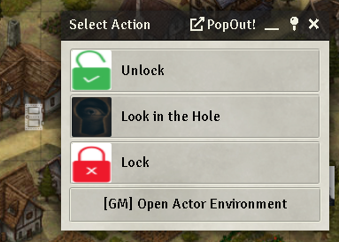
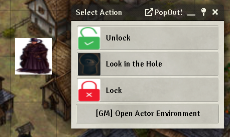
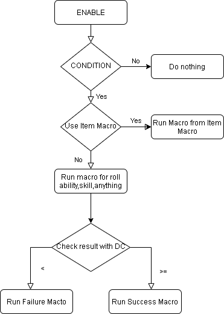

# EIM (Environment Interaction multisystem)

 

[](https://forge-vtt.com/bazaar#package=environment-interaction-multisystem) 


[](https://www.foundryvtt-hub.com/package/environment-interaction-multisystem/)


### If you want to buy me a coffee [](https://www.patreon.com/p4535992)


Environment Interaction allows GM users to create "environment tokens" that characters can interact with. These interactions can include weapon attacks, skill checks and saves, and even executing macros.

When an interaction is selected, the corresponding item on the environment token's actor sheet is created on the character's actor sheet. After rolling the item to chat, the item is deleted from the character's actor sheet. In this way, the character's actor sheet is the same before and after the interaction.

A similar method is used to handle attack and damage rolls. When attack/damage buttons are clicked, the weapon is temporarily created on the character's actor sheet and used for the attack/damage roll before being deleted. This allows the character's relevant game stats to be used for the roll.

Every environment i bind to a specific item configuration where you can set a collection of macro for make everything full customizable and system dependent.

The scope of the module is to give a base for doing smart interactive placable obejct usable from players even when gm is absent and you want to leave something to do to the players.


#### Token Interaction


#### Door Interaction



#### Note Interaction



#### The Idea



### Note: This is module is inspired from the  wonderful work done by these developers:

- [jessev14](https://github.com/jessev14) with its [Environment Interaction](https://github.com/jessev14/environment-interaction) module and the initial inspiration
- [ironmonk88](https://github.com/ironmonk88) with [Monk's TokenBar](https://github.com/ironmonk88/monks-tokenbar)  module 
- [Drental](https://github.com/Drental) with [Token Action HUD](https://github.com/Drental/fvtt-tokenactionhud)
- [League-of-Foundry-Developers](https://github.com/League-of-Foundry-Developers) for the module [Let Me Roll That For You!](https://github.com/League-of-Foundry-Developers/fvtt-module-lmrtfy)
- [Kekilla0](https://github.com/Kekilla0) for the module [Item Macro](https://github.com/Kekilla0/Item-Macro)
- [ardittristan](https://github.com/ardittristan) for the module [VTT Macro Editor](https://github.com/ardittristan/VTTMacroEditor)
- [arcanistzed](https://github.com/arcanistzed) for the module [acelib](https://github.com/arcanistzed/acelib)
- Sorry if i miss someone

**If you want to support more modules of this kind, I invite you to go and support their patreons or kofis account you can found the links on their github pages**

## NOTE: If you are a javascript developer and not a typescript developer, you can just use the javascript files under the dist folder

## Installation

It's always easiest to install modules from the in game add-on browser.

To install this module manually:
1.  Inside the Foundry "Configuration and Setup" screen, click "Add-on Modules"
2.  Click "Install Module"
3.  In the "Manifest URL" field, paste the following url:
`https://raw.githubusercontent.com/p4535992/environment-interaction-multisystem/master/src/module.json`
4.  Click 'Install' and wait for installation to complete
5.  Don't forget to enable the module in game using the "Manage Module" button

### libWrapper

This module uses the [libWrapper](https://github.com/ruipin/fvtt-lib-wrapper) library for wrapping core methods. It is a hard dependency and it is recommended for the best experience and compatibility with other modules.

## Known Issue/Feature to develop

- Still actively developing the better integration with these modules: [Monk's TokenBar](https://github.com/ironmonk88/monks-tokenbar), [Token Action HUD](https://github.com/Drental/fvtt-tokenactionhud), [Let Me Roll That For You!](https://github.com/League-of-Foundry-Developers/fvtt-module-lmrtfy).
- When delete the item on the actor interactor a exception is launched should be solved on foundryvvt 9 for now ignore the exception
- Documentation can be a lot better...
- For know works only on Door, Note and Token
- Trigger happy integration coming soon
- Make css of the list images customizable

## [How to use](./wiki/how_to_use.md) 

## [How to configure the integration with others module](./wiki/how_to_configurate.md)

## [More details on the macro field structure](./wiki/macro_request_structure.md)

## [Community Compendium](./wiki/community_compendium.md)

## Supported systems

The multi system can work with only custom macro, but if you want the 'SUCCESS/FAILURE' integration for now i'm trying to work with these modules:

- [Monk's TokenBar](https://github.com/ironmonk88/monks-tokenbar)
- [Token Action HUD](https://github.com/Drental/fvtt-tokenactionhud)
- [Let Me Roll That For You!](https://github.com/League-of-Foundry-Developers/fvtt-module-lmrtfy)
- [Item Macro](https://github.com/Kekilla0/Item-Macro)

remember the funcionality is limited to the systems supported from these modules. 

By default is "Monk's TokenBar" is present and active and support the  current system is used first else we try with "Token Action HUD", the module "Let Me Roll That For You!" is a special case where you want to display the dialog to the user instead make everything on background, but is still in developing.

| System Id (lowercase) | Token Action HUD | Monk's TokenBar | Let me roll that for you | Item Macro |
|:---------:|:---------------:|:----------------:|:----------------:|:----------------:|
| dnd5ejp | | | x | |
| dnd5e | x | x | x | x |
| dnd4ebeta | | x | | |
| dungeonworld | x | |  | x |
| pf2e | x | x | x | |
| wfrp4e | x | |  | |
| sfrpg | x | x |  | x |
| sw5e | x | x | x | |
| demonlord | x | |  | x |
| pf1 | x | x | x | |
| lancer | x | |  | |
| d35e | x | x | x | |
| swade | x | x |  | x |
| starwarsffg | x | |  | |
| tormenta20 | x | x |  | |
| blades-in-the-dark | x | |  | |
| symbaroum | x | |  | |
| od6s | x | |  | |
| ose | | x | | x |
| alienrpg | x | |  | |
| cthack | x | | | |
| kamigakari | x | |  | |
| tagmar | x | |  | |
| tagmar_rpg | x | |  | |
| ds4 | x | |  | |
| coc | x | | x | |
| cof | x | | x | |
| coc7 | | x | | |
| forbidden-lands | x | |  | |
| cyberpunk-red-core | | |  | x |

naturally in this module the various use cases will have to be foreseen...

## [Item Macro](https://github.com/Kekilla0/Item-Macro) integration

If an item on an environment token has a set Item Macro, after rolling the item to chat, the Item Macro will be executed.
If a item is set with a item macro will be fired before check for any ironmonk token bar or token action hud integration.

## [Ironmonk Token bar](https://github.com/ironmonk88/monks-tokenbar) integration

#### Some example with System Dnd5e examples

| Request Label (Field 'EVENT') | Description | Condition |
|:------------------:|:------------------------:|:-----------------------------------:|
| misc\|misc:init\|       | Roll Initiative          | Need to select a token              |
| save\|save:dex,save:dex\| | Contested Save Dexterity | Need to select a token              |
| ability\|ability:str\|      | Ability Strength         | Need to select a token              |

#### Other example todo when i have time...

#### Little Reminder of the options of 'Monk Tokenbar module'

| Request Element | Request Type | Description |
|:-------------:|:------:|:------:|
| request | string | the string compose from two string 'requestype':'request' e.g. misc:init |
| dc | number | the explicit dc you want for the roll |
| silent | boolean | avoid the dialog popup, but you must have been set a request string |
| fastForward | boolean | MAKE SENSE ONLY WITH "silent=true" the roll is automatic rolled without interaction of the player on the chat |
| flavor | string | the test to show for the roll
| rollmode | string | Type of roll [roll = Public Roll, gmroll = Private GM Roll, blindroll = Blind GM Roll, selfroll = Self Roll, = Self Roll |

Full options example for MonTokenBar :

```
{rollmode : 'roll', silent : true, fastForward: true, dc: 13, request: misc:init}
```

#### Request Roll (Initiave, Death Save, Saving Throw ecc.)

``` 
const options = {rollmode : 'roll', silent : true, fastForward: true, dc: 13, request: 'misc:init'};
const interactorToken = canvas.tokens?.controlled[0];
game.MonksTokenBar.requestRoll([interactorToken],options);
```

other example but when you want the rol on the current token

``` 
const options = {rollmode : 'roll', silent : true, fastForward: true, dc: 13, request: 'misc:init'};
const interactorToken = args[0];
game.MonksTokenBar.requestRoll([interactorToken],options);
```

```
game.MonksTokenBar.requestRoll([{token:"Thoramir", altKey: true},"John Locke", {token:"Toadvine", fastForward:true}], {request:'perception',dc:15, silent:true, fastForward:false, flavor:'Testing flavor'})
```

#### Contested Request Roll (Initiave, Death Save, Saving Throw ecc.)

``` 
const options = {rollmode : 'roll', silent : true, fastForward: true, dc: 13, request: 'misc:init'};
const interactorToken = canvas.tokens?.controlled[0];
game.MonksTokenBar.requestRoll([interactorToken],options);
```

## [Token Action HUD](https://github.com/Drental/fvtt-tokenactionhud) integration

#### Little Reminder of the options of 'Token Action HUD'

**NOTE: tokenId = "multi" make start the action for all the selected tokens.**

##### System Dnd5e examples

| Macro Type of Token Action HUD for Dnd5e |
|:----------:|
| ability |
| skill |
| abilitySave |
| abilityCheck |
| item |
| spell |
| feat |
| utility |
| effect |
| condition |

| Request Label (Field 'EVENT') | Description | Condition |
|:------------------:|:------------------------:|:-----------------------------------:|
| ability\|ability:str | Ability Strength / Save Throw Strength | Need to select a token |

**IMPORTANT: Token Action HUD at the moment doen't have a hook for callback the macro 'SUCCES' or 'FAILURE' a feature request is been opened about it [[Feature request] Add a hook for retrieve the result detail of the roll launched with Token Action Hud](https://github.com/Drental/fvtt-tokenactionhud/issues/123)**

#### Other example todo when i have time...

## [Let me roll that for you](https://github.com/League-of-Foundry-Developers/fvtt-module-lmrtfy) integration (need help with this)

# Build

## Install all packages

```bash
npm install
```
## npm build scripts

### build

will build the code and copy all necessary assets into the dist folder and make a symlink to install the result into your foundry data; create a
`foundryconfig.json` file with your Foundry Data path.

```json
{
  "dataPath": "~/.local/share/FoundryVTT/"
}
```

`build` will build and set up a symlink between `dist` and your `dataPath`.

```bash
npm run-script build
```

### NOTE:

You don't need to build the `foundryconfig.json` file you can just copy the content of the `dist` folder on the module folder under `modules` of Foundry

### build:watch

`build:watch` will build and watch for changes, rebuilding automatically.

```bash
npm run-script build:watch
```

### clean

`clean` will remove all contents in the dist folder (but keeps the link from build:install).

```bash
npm run-script clean
```
### lint and lintfix

`lint` launch the eslint process based on the configuration [here](./.eslintrc)

```bash
npm run-script lint
```

`lintfix` launch the eslint process with the fix argument

```bash
npm run-script lintfix
```

### prettier-format

`prettier-format` launch the prettier plugin based on the configuration [here](./.prettierrc)

```bash
npm run-script prettier-format
```

### package

`package` generates a zip file containing the contents of the dist folder generated previously with the `build` command. Useful for those who want to manually load the module or want to create their own release

```bash
npm run-script package
```

## [Changelog](./changelog.md)

## Issues

Any issues, bugs, or feature requests are always welcome to be reported directly to the [Issue Tracker](https://github.com/p4535992/environment-interactionenvironment-interaction-multisystem/issues ), or using the [Bug Reporter Module](https://foundryvtt.com/packages/bug-reporter/).

## License

- **[Environment Interaction](https://github.com/jessev14/environment-interaction)** : [MIT](https://github.com/jessev14/environment-interaction/blob/main/LICENSE)

- **[Monk's TokenBar](https://github.com/ironmonk88/monks-tokenbar)** : [GPL-3.0 License](https://github.com/ironmonk88/monks-tokenbar/blob/main/LICENSE)

- **[Token Action HUD](https://github.com/Drental/fvtt-tokenactionhud)** : [Creative Commons Attribution 4.0](https://creativecommons.org/licenses/by/4.0/)

- **[Let Me Roll That For You!](https://github.com/League-of-Foundry-Developers/fvtt-module-lmrtfy)** : [Creative Commons Attribution 4.0 International License](https://creativecommons.org/licenses/by/4.0/)

- **[Item Macro](https://github.com/Kekilla0/Item-Macro)** : [MIT](https://raw.githubusercontent.com/Kekilla0/Item-Macro/master/LICENSE)

- **[VTT Macro Editor](https://github.com/ardittristan/VTTMacroEditor)**: [MIT](https://github.com/ardittristan/VTTMacroEditor/blob/master/LICENSE)

- **[acelib](https://github.com/arcanistzed/acelib)**: [MIT](https://github.com/arcanistzed/acelib/blob/main/LICENSE)

This package is under an [GPL-3.0 License](LICENSE) and the [Foundry Virtual Tabletop Limited License Agreement for module development](https://foundryvtt.com/article/license/).

## Credits

- [jessev14](https://github.com/jessev14) for the module [Environment Interaction](https://github.com/jessev14/environment-interaction)
- [ironmonk88](https://github.com/ironmonk88) for the module [Monk's TokenBar](https://github.com/ironmonk88/monks-tokenbar)
- [Drental](https://github.com/Drental) for the module [Token Action HUD](https://github.com/Drental/fvtt-tokenactionhud)
- [League-of-Foundry-Developers](https://github.com/League-of-Foundry-Developers) for the module [Let Me Roll That For You!](https://github.com/League-of-Foundry-Developers/fvtt-module-lmrtfy)
- [Kekilla0](https://github.com/Kekilla0) for the module [Item Macro](https://github.com/Kekilla0/Item-Macro)
- [ardittristan](https://github.com/ardittristan) for the module [VTT Macro Editor](https://github.com/ardittristan/VTTMacroEditor)
- [arcanistzed](https://github.com/arcanistzed) for the module [acelib](https://github.com/arcanistzed/acelib)

## Acknowledgements

Bootstrapped with League of Extraordinary FoundryVTT Developers  [foundry-vtt-types](https://github.com/League-of-Foundry-Developers/foundry-vtt-types).
