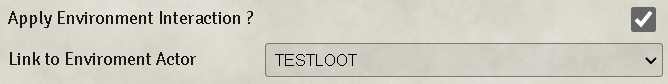
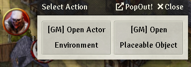
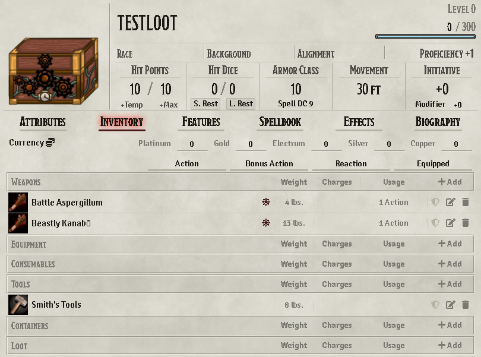
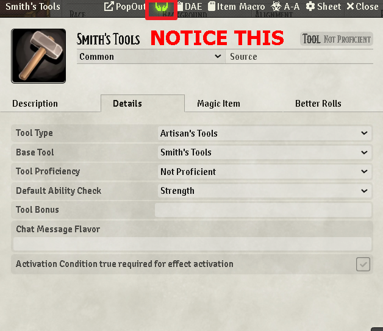
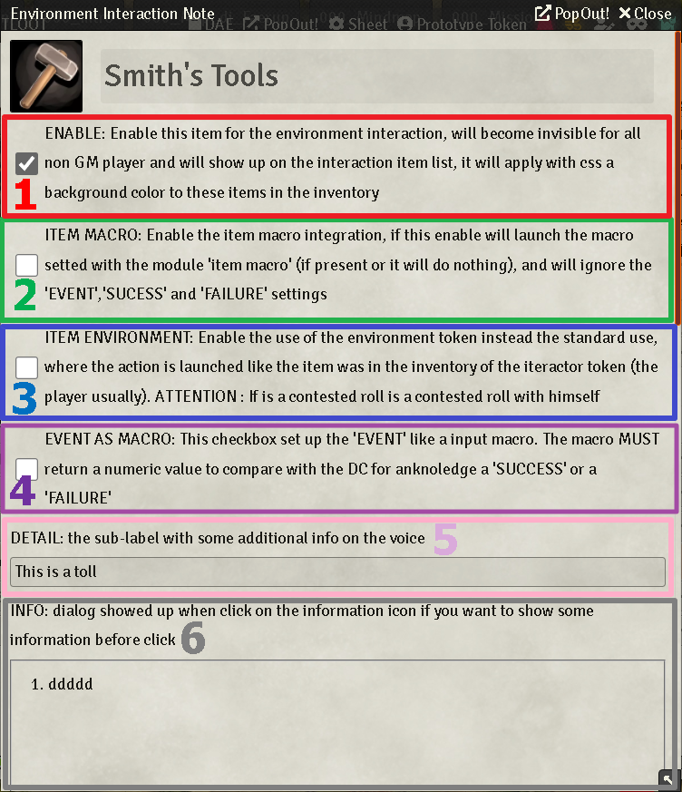
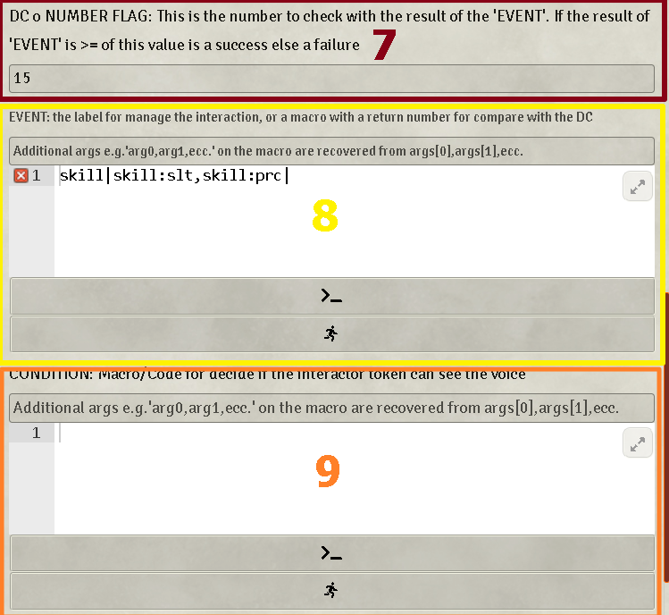
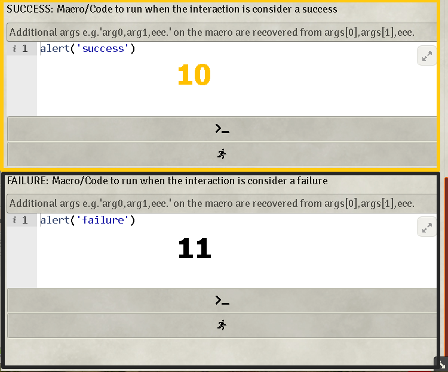
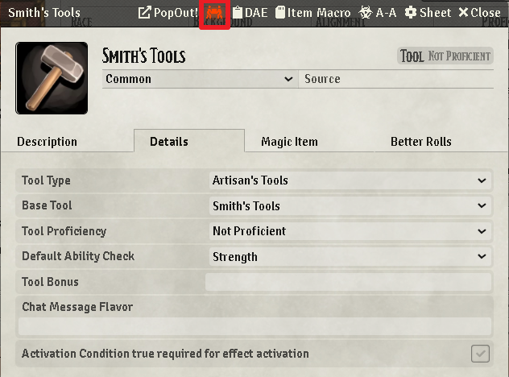
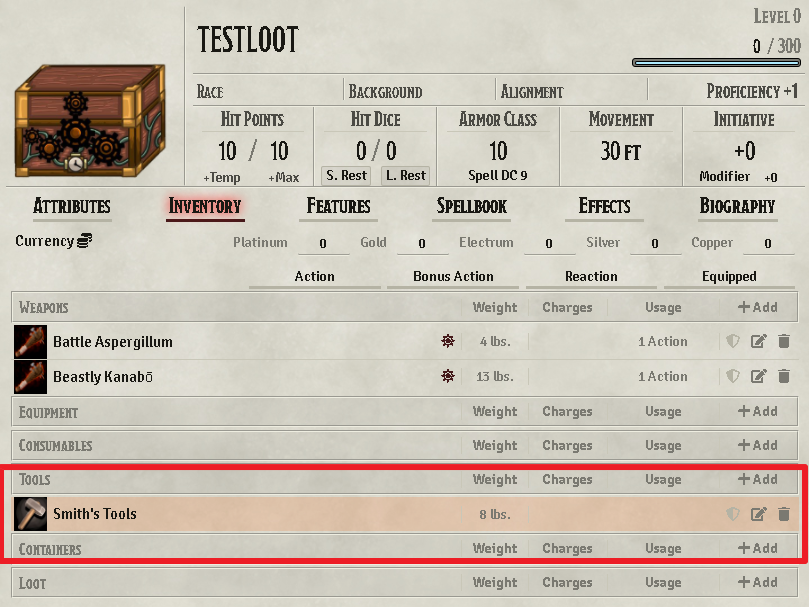
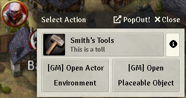

# Steps to follow

An environment object is created like any other token. Once placed on the obejct on canvas, the object can be set as an "environment interaction" using the token configuration window.

This configuration is present in Drawing, Token, Wall, ecc.

After checked ther checkbox to true, you must link the placeable object to the actor enviroment container with the option 'Link to enviroment actor'.

After that when you double clicking on the environment object will open its Select Action dialog window. GM users will also have a button to open the character sheet enviroment and the placeable dialog configuration.

Now let's go the the actor sheet by clickin the '[GM] Open Actor Enviroment' button:

a generic actor with generic items... now let's go the the Smith's Tool sheet item, you will notice a green hands icon click on that...

Now a big form will appear:

The form has a total of 11 element to set for all the use case it's possible to encounter here the details

1. ENABLE: Enable this item for the environment interaction, will become invisible for all non GM player and will show up on the interaction  item list, it will apply with css a background color to these items in the inventory
2. ITEM MACRO: Enable the item macro integration, if this enable will launch the macro setted with the module 'item macro' (if present or it will do nothing), and will ignore the 'EVENT','SUCESS' and 'FAILURE' settings
3. ITEM ENVIRONMENT: Enable the use of the environment token instead the standard use, where the action is launched like the item was in the inventory of the iteractor token (the player usually). ATTENTION : If is a contested roll is a contested roll with himself
4. EVENT AS MACRO: This checkbox set up the 'EVENT' like a input macro. The macro MUST return a numeric value to compare with the DC for anknoledge a 'SUCCESS' or a 'FAILURE'"
5. DETAIL: the sub-label with some additional info on the voice
6. INFO: dialog showed up when click on the information icon if you want to show some information before click
7. DC o NUMBER FLAG: This is the number to check with the result of the 'EVENT'. If the result of 'EVENT' is >= of this value is a success else a failure", usually if you use a _contested roll of the token bar module_ this value is better to left empty. Important if no DC is setted by default the macro launched on the end is the 'SUCCESS'. 
8. EVENT: the label for manage the interaction, or a macro with a return number for compare with the DC
9. CONDITION: Macro/Code for decide if the interactor token can see the voice
10. SUCCESS: Macro/Code to run when the interaction is consider a success
11. FAILURE: Macro/Code to run when the interaction is consider a failure

After the set up close the form and all your data are saved on the item.
IF THE 'ENABLE' CHECK BOX IS CHECKED you have abiitate this item for the enviroment interaction. You can confirm this from two feature:

1) The orange carry symbol on the item header sheet has replace the green hands icon

2) On the actor inventory a bckground color remind you that

After that when you double clicking on the environment object will open its Select Action dialog window BUT NOW you will see hte new item abilitate:

now you click on the item and the module will run the 'EVENT' configuration and the 'SUCCESS' or the 'FAILURE' macro.